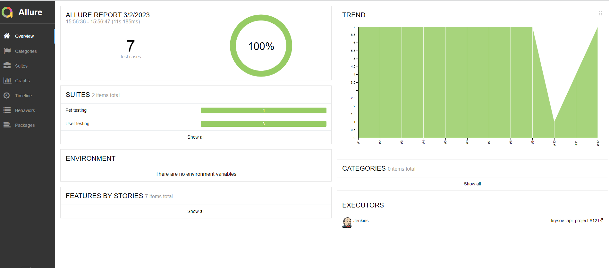
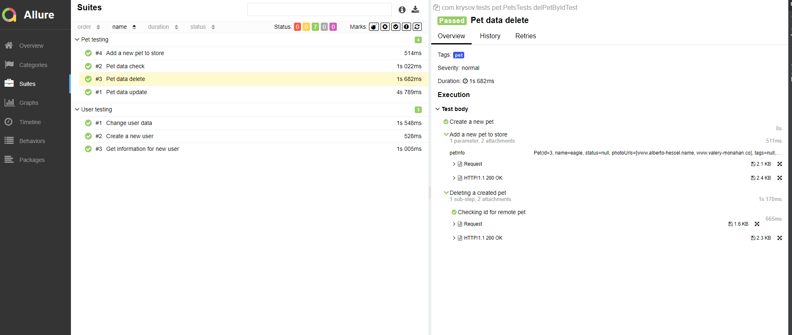
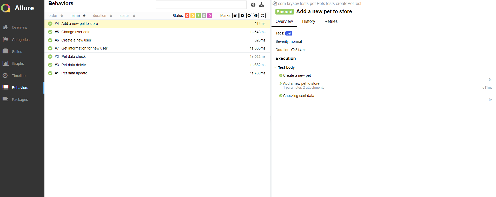
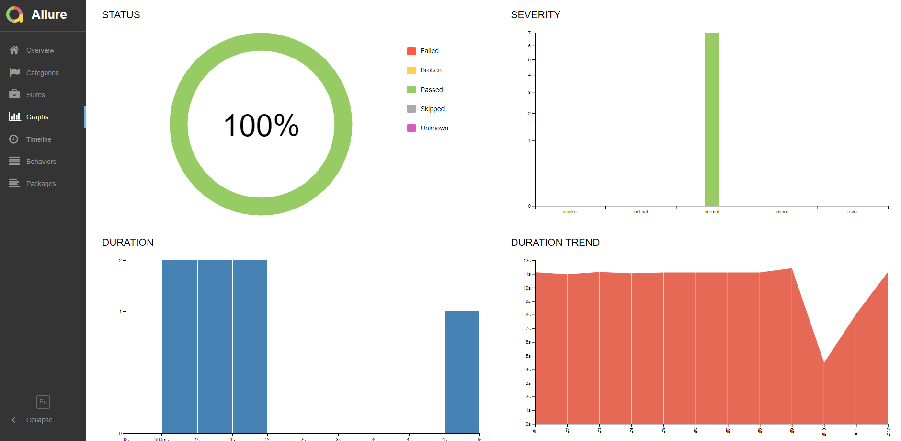
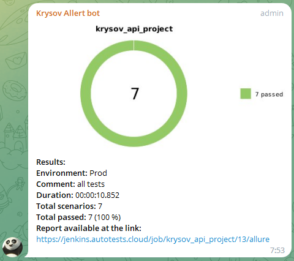

## Проект по автоматизации API на тестовой платформе [Swagger Petstore](https://petstore.swagger.io/#/)

### &nbsp;&nbsp;&nbsp;&nbsp;&nbsp;&nbsp;&nbsp;&nbsp;&nbsp;:heavy_check_mark: [Тесты для раздела Pets](https://github.com/AlexKrysov/petstore_krysov/tree/main/src/test/java/com/krysov/tests/pet)

### &nbsp;&nbsp;&nbsp;&nbsp;&nbsp;&nbsp;&nbsp;&nbsp;&nbsp;:heavy_check_mark: [Тесты для раздела Store](https://github.com/AlexKrysov/petstore_krysov/tree/main/src/test/java/com/krysov/tests/user)

## :rocket: Технологии и инструменты:

<p  align="center"
<code></code>
<code></code>
<code></code>
<code></code>
<code></code>
<code></code>
<code></code>
<code></code>
<code></code>
</p>

## Покрыт следующий функционал:
* API тесты:
    * ✅ Создание экземпляра питомца с рандомными параметрами
    * ✅ Обновление питомца
    * ✅ Удаление созданного питомца
    * ✅ Создание заказа с привязкой к питомцу
    * ✅ Удаление заказа


## Как запустить:
### Локально запуск всех тестов
```bash
gradle clean test
```


### Запуск тестов в разделе store
```bash
gradle clean api_user
```

### Запуск тестов в разделе pet
```bash
gradle clean api_pet
```

## Запуск в Jenkins:
OVERVIEW
<br >
<a href="https://ibb.co/TvwPjzj"></a>

SUITES
<br >
<a href="https://ibb.co/TvwPjzj"></a>

BEHAVIORS
<br >
<a href="https://ibb.co/TvwPjzj"></a>

STATUS
<br >
<a href="https://ibb.co/TvwPjzj"></a>


[//]: # (## Интеграция с JIRA:)

[//]: # (<a href="https://ibb.co/TvwPjzj"></a>)

## Интеграция с TELEGRAM:
<a href="https://ibb.co/TvwPjzj"></a>

[//]: # (## Интеграция с Allure TestOPS:)

[//]: # (CUSTOM DASHBOARD)

[//]: # (<br >)

[//]: # (<a href="https://ibb.co/TvwPjzj"></a>)

[//]: # ()
[//]: # (LAUNCHES)

[//]: # (<br >)

[//]: # (<a href="https://ibb.co/TvwPjzj"></a>)

[//]: # ()
[//]: # (DEFAULT DASHBOARD)

[//]: # (<br >)

[//]: # (<a href="https://ibb.co/TvwPjzj"></a>)

[//]: # ()
[//]: # (SUITES)

[//]: # (<br >)
<a href="https://ibb.co/TvwPjzj"></a>